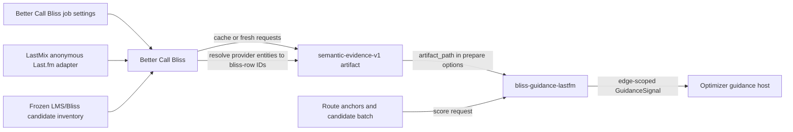

# bliss-guidance-lastfm

`bliss-guidance-lastfm` is a provider addon for the `bliss-playlist-optimizer`
guidance SPI. The initial implementation consumes the existing
`semantic-evidence-v1` raw artifact produced by Better Call Bliss. It returns
resolved, local-candidate Last.fm guidance for the current route edge;
unresolved provider identities are ignored.

Its SPI provider ID is `lastfm-guidance`. It does not contact Last.fm itself;
Better Call Bliss/LastMix remains responsible for obtaining and caching the raw
artifact.

## Data and information flow



Better Call Bliss owns all user-facing Last.fm configuration: whether Last.fm
guidance is enabled and the per-job similar-track and similar-artist guidance
percentages. It uses its LastMix integration to collect track- and
artist-similarity observations, tolerates unavailable network access, and can
reuse cached observations. Before launching the optimizer, Better Call Bliss
resolves those observations against the frozen local candidate inventory and
writes only resolved local candidate identities into `semantic-evidence-v1`.

This add-on consumes no BlissMixer, BlissMixerLab, LastMix, or Better Call Bliss
setting directly. Its only configuration is the trusted `artifact_path` passed
in the SPI `prepare` request. That separation keeps provider acquisition,
settings interpretation, identity matching, and network failures outside the
native route-search process.

During `prepare`, the add-on reads the artifact once and builds an index of
`source entity -> local candidate ID -> strongest support`. For each `score`
request it looks at the supplied left and right anchor IDs, evaluates only the
requested candidate batch, and emits an edge-scoped positive signal for a
candidate supported by either endpoint. It retains the strongest relation after
combining raw Last.fm score (or rank) with identity confidence. Unresolved
entities, unavailable endpoint evidence, and candidates without an edge emit no
signal; they remain neutral.

The current optimizer host records these signals and diagnostics, but its first
SPI gate does not yet apply them to route selection. Existing Better Call Bliss
request-level Last.fm selection settings remain the active compatibility path
until shared host-side reranking is connected.

This deliberately separates provider acquisition from optimizer scoring. A
future transport implementation could fetch anonymous Last.fm data directly, but
it would need to preserve the same frozen-evidence and failure-tolerant
contract.

Prepare options:

```json
{ "artifact_path": "/path/to/semantic-evidence.json" }
```

The addon communicates through versioned JSONL on stdin/stdout. It contributes
bounded guidance only; Bliss acoustic quality and all hard route constraints
remain optimizer responsibilities.
