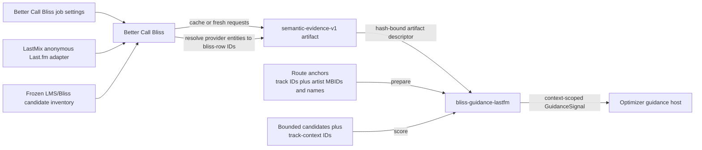

# bliss-guidance-lastfm

`bliss-guidance-lastfm` is a provider addon for a Bliss-first host using the
[`bliss-playlist-guidance-spi`](https://github.com/chrober/bliss-playlist-guidance-spi).
The current host is `bliss-playlist-optimizer`. It consumes the existing
`semantic-evidence-v1` raw artifact
produced by Better Call Bliss and returns resolved, local-candidate Last.fm
guidance for the current global or edge route context; unresolved provider
identities are ignored.

The host-neutral wire contract is maintained by
[bliss-playlist-guidance-spi](https://github.com/chrober/bliss-playlist-guidance-spi).

Its SPI provider ID is `lastfm-guidance`. It does not contact Last.fm itself;
Better Call Bliss/LastMix remains responsible for obtaining and caching the raw
artifact.

## Data and information flow



Better Call Bliss owns all user-facing Last.fm configuration: whether Last.fm
guidance is enabled and the per-job similar-track and similar-artist guidance
percentages. It uses its LastMix integration to collect track- and
artist-similarity observations, tolerates unavailable network access, and can
reuse cached observations. Before launching the optimizer, Better Call Bliss
resolves those observations against the frozen local candidate inventory and
writes only resolved local candidate identities into `semantic-evidence-v1`.

This add-on consumes no BlissMixer, BlissMixerLab, LastMix, or Better Call
Bliss setting directly. Better Call Bliss passes the artifact in an SPI v2
`prepare` descriptor with its expected SHA-256; the provider verifies the hash
before decoding it. That separation keeps acquisition, settings interpretation,
identity matching, and network failures outside the native route-search
process.

During `prepare`, the add-on reads the artifact once and builds an index of
`source entity -> local candidate ID -> channel -> strongest support`. It also
uses the supplied local anchors to build `track anchor ID -> Last.fm artist
source ID(s)`: it joins an anchor's artist MBID to an artist edge's MBID first,
then uses a normalized artist-name fallback only when no MBID relation exists.
The result is frozen for that provider session and reported as
`track_artist_mappings` in prepared diagnostics.

For each `score` request the add-on expands all applicable local context track
IDs into those prepared artist source IDs. This includes global
`context_track_ids` and both `left_anchor_id` and `right_anchor_id` for an edge;
raw track IDs remain present so recording-level evidence still works. It then
evaluates only the requested candidate batch and emits positive signals for the
independently weighted `lastfm_track` and `lastfm_artist` channels. Within one
channel it retains the strongest relation after combining raw Last.fm score (or
rank) with identity confidence. Unresolved entities, unavailable endpoint
evidence, and candidates without support emit no signal; they remain neutral.

## Track, artist, and Last.fm identities

The four relevant identities are intentionally different:

| Identity | Example shape | Owner and purpose |
| --- | --- | --- |
| Host route track ID | `lms-track-123` | The optimizer's score context and Better Call Bliss source/history anchors. |
| Last.fm artist source ID | `artist:normalized-artist-name` | The resolved `artist.getSimilar` evidence edge. It is not sent back as a route track ID. |
| MusicBrainz artist ID | `xxxxxxxx-xxxx-xxxx-xxxx-xxxxxxxxxxxx` | Stable cross-source join key carried in the anchor and resolved artifact whenever available. |
| Local candidate ID | `bliss-row-456` | A frozen, eligible local Bliss/LMS candidate. This is the only ID the provider may return in a signal. |

In other words, an artist relation follows the chain `lms-track-123 -> anchor
artist MBID -> artist:... -> bliss-row-456`. Recording similarity can use the
host track ID directly where the artifact has that relationship. This prevents a
Last.fm artist source ID from being mistaken for either a route member or a
local candidate.

The optimizer owns channel weights and applies these advisory signals only after
Bliss has admitted candidates acoustically and all hard constraints have passed.

This deliberately separates provider acquisition from optimizer scoring. A
future transport implementation could fetch anonymous Last.fm data directly, but
it would need to preserve the same frozen-evidence and failure-tolerant
contract.

SPI v2 prepare input:

```json
{
  "artifacts": [{
    "kind": "resolved-lastfm-evidence-v1",
    "path": "/path/to/semantic-evidence.json",
    "sha256": "..."
  }],
  "resources": []
}
```

The addon communicates through versioned JSONL on stdin/stdout. It contributes
bounded guidance only; Bliss acoustic quality and all hard route constraints
remain optimizer responsibilities.
