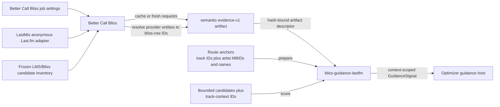

# bliss-guidance-lastfm

`bliss-guidance-lastfm` is a provider addon for a Bliss-first host using the
[`bliss-playlist-guidance-spi`](https://github.com/chrober/bliss-playlist-guidance-spi).
Current hosts use two acquisition modes. **Artifact mode** consumes a frozen,
resolved `semantic-evidence-v1` artifact prepared by trusted host code (for
example through LastMix). **Direct mode** obtains relations once during
`prepare`, using an API key inherited only through the process environment,
then freezes them in a versioned local TTL cache. Both modes return the same
bounded `lastfm_track` and `lastfm_artist` guidance; `score` never performs
network I/O.

The host-neutral wire contract is maintained by
[bliss-playlist-guidance-spi](https://github.com/chrober/bliss-playlist-guidance-spi).

Its SPI provider ID is `lastfm-guidance`. In artifact mode, Better Call Bliss
and LastMix remain responsible for obtaining and resolving evidence. In direct
mode, this binary contacts Last.fm only during `prepare`.

## Data and information flow


```mermaid
flowchart LR
    S[Better Call Bliss job settings] --> B[Better Call Bliss]
    L[LastMix anonymous Last.fm adapter] --> B
    B -->|cache or fresh requests| E[semantic-evidence-v1 artifact]
    I[Frozen LMS/Bliss candidate inventory] --> B
    B -->|resolve provider entities to bliss-row IDs| E
    E -->|hash-bound artifact descriptor| P[bliss-guidance-lastfm]
    A[Route anchors\ntrack IDs plus artist MBIDs and names] -->|prepare| P
    C[Bounded candidates plus\ntrack-context IDs] -->|score| P
    P -->|context-scoped GuidanceSignal| O[Optimizer guidance host]
```

Better Call Bliss owns all user-facing Last.fm configuration: whether Last.fm
guidance is enabled and the per-job similar-track and similar-artist guidance
percentages. It uses its LastMix integration to collect track- and
artist-similarity observations, tolerates unavailable network access, and can
reuse cached observations. Before launching the optimizer, Better Call Bliss
resolves those observations against the frozen local candidate inventory and
writes only resolved local candidate identities into `semantic-evidence-v1`.

This add-on consumes no BlissMixer, BlissMixerLab, LastMix, or Better Call
Bliss setting directly. In artifact mode, Better Call Bliss passes a prepared
artifact in an SPI v2 `prepare` descriptor with its expected SHA-256; the
provider verifies the hash before decoding it. In direct mode, the trusted host
passes non-secret connection limits and supplies the API key through the child
process environment only.

During `prepare`, the add-on reads the artifact once and builds an index of
`source entity -> local candidate ID -> channel -> strongest support`. It also
uses the supplied local anchors to build `track anchor ID -> Last.fm artist
source ID(s)`: it joins an anchor's artist MBID to an artist edge's MBID first,
then uses a normalized artist-name fallback only when no MBID relation exists.
The result is frozen for that provider session and reported as
`track_artist_mappings` in prepared diagnostics.

For each `score` request the add-on expands all applicable local context track
IDs into those prepared artist source IDs. This includes global
`context_track_ids` and both `left_anchor_id` and `right_anchor_id` for an edge;
raw track IDs remain present so recording-level evidence still works. It then
evaluates only the requested candidate batch and emits positive signals for the
independently weighted `lastfm_track` and `lastfm_artist` channels. Within one
channel it retains the strongest relation after combining raw Last.fm score (or
rank) with identity confidence. Unresolved entities, unavailable endpoint
evidence, and candidates without support emit no signal; they remain neutral.

## Track, artist, and Last.fm identities

The four relevant identities are intentionally different:

| Identity | Example shape | Owner and purpose |
| --- | --- | --- |
| Host route track ID | `lms-track-123` | The optimizer's score context and Better Call Bliss source/history anchors. |
| Last.fm artist source ID | `artist:normalized-artist-name` | The resolved `artist.getSimilar` evidence edge. It is not sent back as a route track ID. |
| MusicBrainz artist ID | `xxxxxxxx-xxxx-xxxx-xxxx-xxxxxxxxxxxx` | Stable cross-source join key carried in the anchor and resolved artifact whenever available. |
| Local candidate ID | `bliss-row-456` | A frozen, eligible local Bliss/LMS candidate. This is the only ID the provider may return in a signal. |

In other words, an artist relation follows the chain `lms-track-123 -> anchor
artist MBID -> artist:... -> bliss-row-456`. Recording similarity can use the
host track ID directly where the artifact has that relationship. This prevents a
Last.fm artist source ID from being mistaken for either a route member or a
local candidate.

The optimizer owns channel weights and applies these advisory signals only after
Bliss has admitted candidates acoustically and all hard constraints have passed.

`lastfm_track` declares support for the host's `bounded_influence` policy.
`lastfm_artist` declares both `bounded_influence` and `target_share` support.
Those declarations do not alter the raw observations emitted by this provider:
the host chooses and applies the policy after it receives the same normalized
track or artist support. In particular, the provider never calculates a target
share multiplier or ranks candidates itself.

Direct mode accepts only trusted launch configuration: `acquisition_mode`,
cache path/TTL, deadline, bounded request concurrency, and (where a test or a
trusted host needs it) the Last.fm endpoint. Its API key is read solely from
`BLISS_GUIDANCE_LASTFM_API_KEY`; it is never included in options, requests,
artifacts, cache entries, diagnostics, or errors. Cache misses are fetched by a
bounded worker pool (at most `max_concurrent_requests`), and transient `429`,
`5xx`, and transport failures receive two short deadline-bounded retries.
Successful empty relations are cached like any other result. When requests
remain unavailable, `prepare` succeeds in a redacted `degraded` state with
neutral guidance for those sources, so the host can continue with Bliss-only
selection.

SPI v2 prepare input:

```json
{
  "artifacts": [{
    "kind": "resolved-lastfm-evidence-v1",
    "path": "/path/to/semantic-evidence.json",
    "sha256": "..."
  }],
  "resources": []
}
```

`version --json` exposes declared host-policy support: `lastfm_track` supports
bounded influence, while `lastfm_artist` supports bounded influence and target
share. A host can use this metadata to avoid offering an unsupported choice.

The addon communicates through versioned JSONL on stdin/stdout. It contributes
bounded guidance only; Bliss acoustic quality and all hard route constraints
remain optimizer responsibilities.
